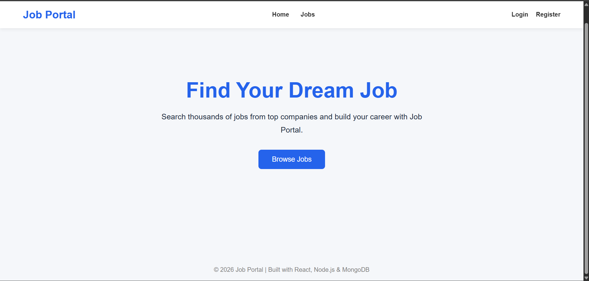
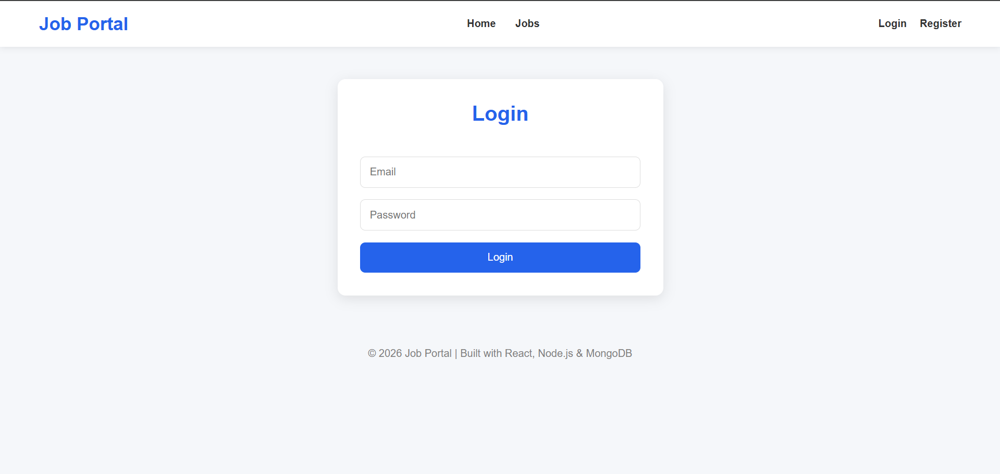
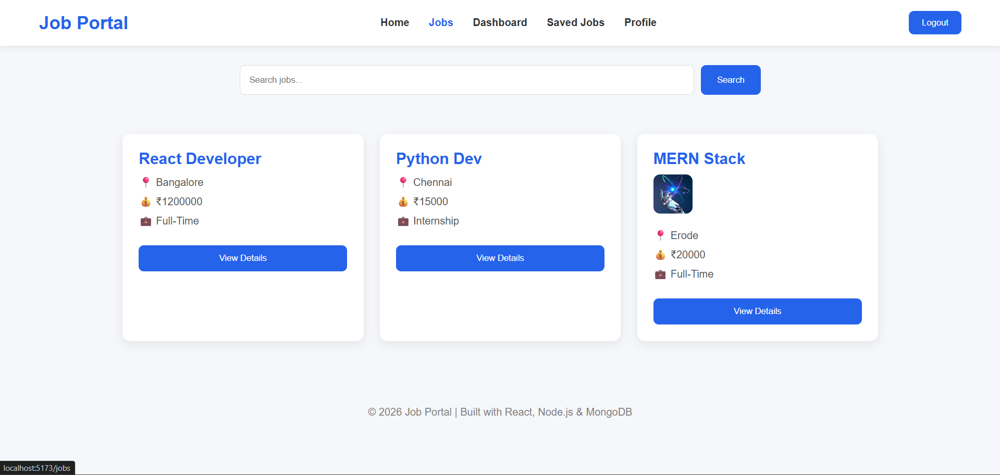
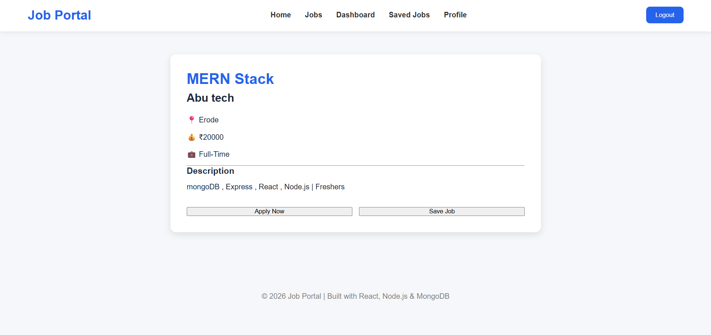
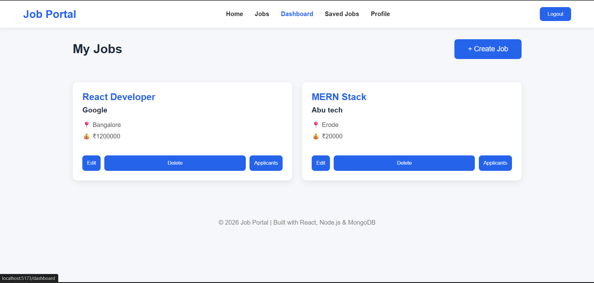
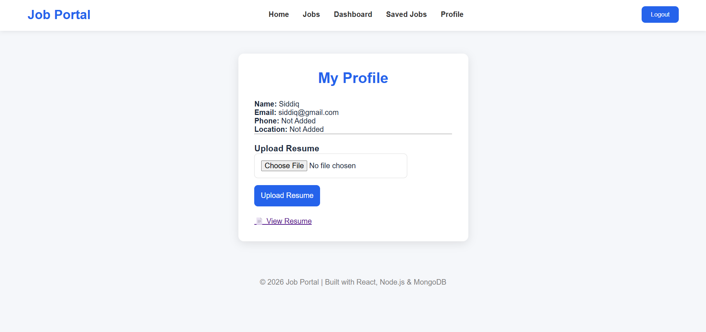
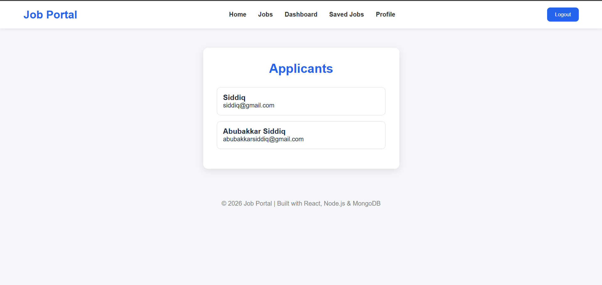

<div align="center">

# 🚀 MERN Job Portal

### A Full Stack Job Portal built using the MERN Stack

Find Jobs • Apply Jobs • Save Jobs • Recruiter Dashboard • Resume Upload • Company Logo Upload

---


</div>

---

# 📖 About

This project is a **Full Stack MERN Job Portal** developed as a portfolio project.

It supports two types of users:

### 👨‍💼 Job Seekers
- Register & Login
- Search Jobs
- View Job Details
- Apply for Jobs
- Save Jobs
- Upload Resume
- View Profile

### 🏢 Recruiters
- Create Jobs
- Edit Jobs
- Delete Jobs
- Upload Company Logo
- View Applicants
- Download Applicant Resume

---

# ✨ Features

## 🔐 Authentication

- JWT Authentication
- Password Hashing using bcrypt
- Protected Routes
- Login / Register
- Logout

---

## 👤 Job Seeker

- Browse Jobs
- Search Jobs
- View Job Details
- Apply for Jobs
- Save Jobs
- Resume Upload
- Profile Management

---

## 🏢 Recruiter

- Create Job
- Edit Job
- Delete Job
- Recruiter Dashboard
- Company Logo Upload
- View Applicants
- Resume Download

---

## 📁 File Upload

- Resume Upload (PDF)
- Company Logo Upload
- Multer Storage
- Static File Serving

---

## ⚡ Backend

- REST API
- Express.js
- MongoDB Atlas
- Mongoose
- MVC Architecture
- JWT Authentication
- bcrypt Password Encryption

---

## 🎨 Frontend

- React
- React Router
- Axios
- Context API
- Protected Routes
- Responsive Layout

---

# 🛠 Tech Stack

| Frontend | Backend | Database | Authentication | Upload |
|-----------|----------|-----------|----------------|---------|
| React | Node.js | MongoDB Atlas | JWT | Multer |
| React Router | Express.js | Mongoose | bcrypt | File Upload |
| Axios | REST API | | | |

---

# 📂 Folder Structure

```text
Job-Portal
│
├── client
│   ├── src
│   │   ├── components
│   │   ├── context
│   │   ├── pages
│   │   ├── services
│   │   ├── styles
│   │   └── App.jsx
│
├── server
│   ├── config
│   ├── controllers
│   ├── middleware
│   ├── models
│   ├── routes
│   ├── uploads
│   └── server.js
```

---

# 📸 Screenshots

## Home Page



---

## Login



---

## Jobs



---

## Job Details



---

## Dashboard



---

## Profile



---

## Applicants



---

# ⚙ Installation

## Clone Repository

```bash
git clone https://github.com/YOUR_USERNAME/mern-job-portal.git
```

---

## Backend

```bash
cd server

npm install

npm run dev
```

---

## Frontend

```bash
cd client

npm install

npm run dev
```

---

# 🔑 Environment Variables

Create `.env` inside the **server** folder.

```env
PORT=5000

MONGO_URI=your_mongodb_connection

JWT_SECRET=your_secret_key
```

---

# 📡 API Endpoints

## Authentication

```
POST /api/auth/register

POST /api/auth/login
```

---

## Jobs

```
GET /api/jobs

GET /api/jobs/:id

GET /api/jobs/search

POST /api/jobs

PUT /api/jobs/:id

DELETE /api/jobs/:id

POST /api/jobs/:id/apply

POST /api/jobs/:id/save

GET /api/jobs/:id/applicants
```

---

## Users

```
GET /api/users/profile

PUT /api/users/profile
```

---

## Upload

```
POST /api/upload/resume

POST /api/upload/logo
```

---

# 🧠 Concepts Used

- React Hooks
- React Router
- Context API
- Axios
- REST APIs
- JWT Authentication
- Password Hashing
- MongoDB Relationships
- populate()
- Multer
- MVC Pattern
- Protected Routes

---

# 🚀 Future Improvements

- Email Notifications
- Forgot Password
- Admin Dashboard
- Google Login
- Dark Mode

---

# 👨‍💻 Author

## **ABUBAKKAR SIDDIQ**

B.Sc Computer Science

Full Stack MERN Developer (Fresher)

📍 Tamil Nadu, India

---

<div align="center">

⭐ If you like this project, give it a Star.

</div>
